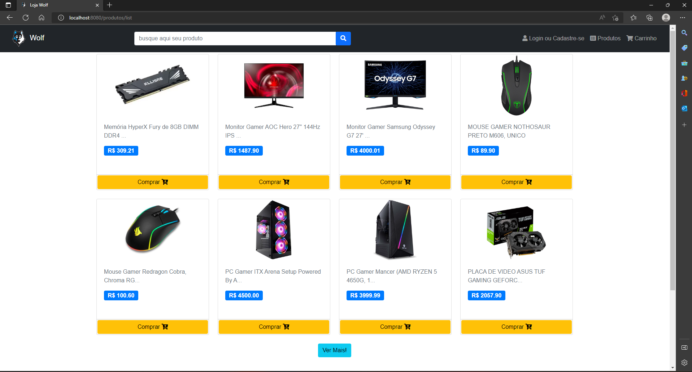
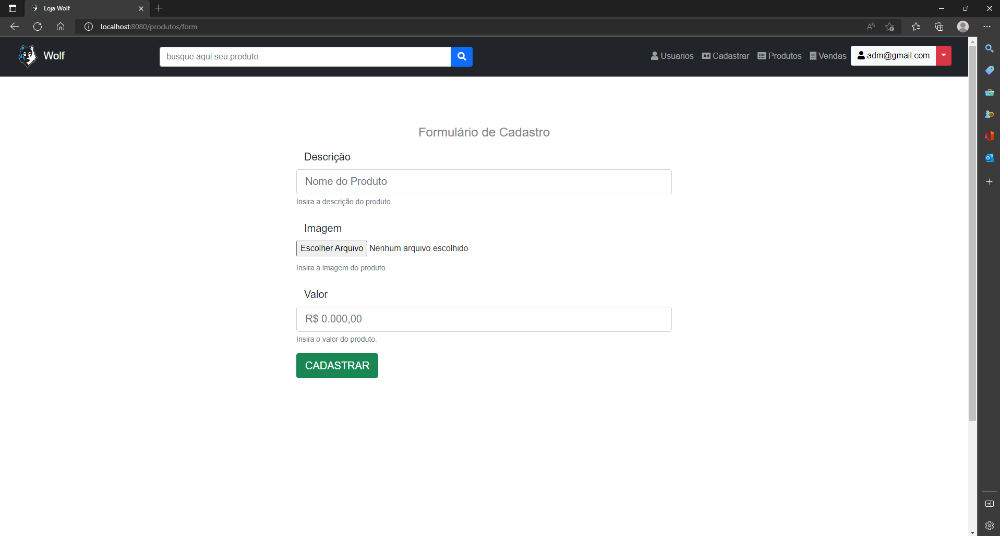
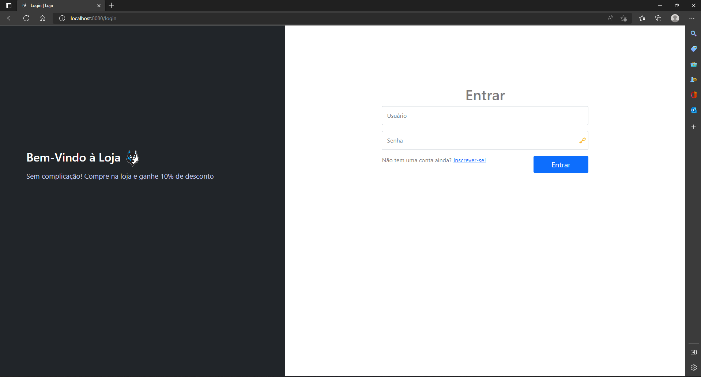

# Site de vendas Wolf
## 🚀 Começando
loja de vendas de hardwares.O usuário do tipo cliente poderá simular uma compra de um produto  ou vários simplesmente adicionando ele ao seu carrinho de compras, escolhendo seu endereço de entrega de forma simples adicionando seu cep, posteriormente escolhendo a forma de pagamento que pode ser por pix, boleto ou cartão de crédito. Após realizar sua compra ele terá um histórico de todas as suas compras finalizadas.

O usuário do tipo administrador pode cadastrar produtos colocando preço, uma imagem e a descrição do produto poderá também editar, visualizar os clientes cadastrados em sua loja  e suas vendas feitas, podendo selecionar uma e visualizar o pedido.

### 🔧 Tecnologias usadas
* Spring boot
* thymeleaf
* bootstrap 4
* JavaScript
* Java 11
* mysql
* jquery
  
## 📌 Preview de algumas páginas 
## página Home

## página Cadastro de Produtos

## página Login do Usuário

